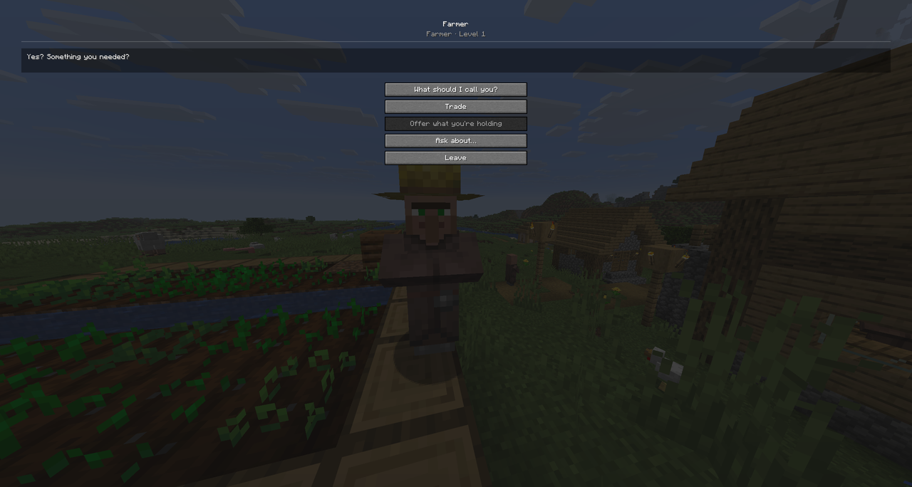
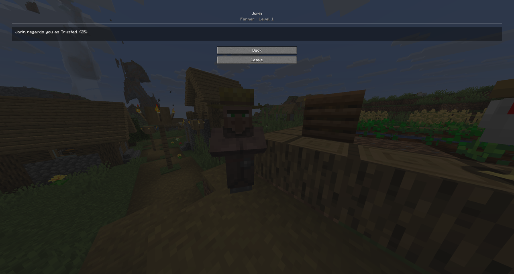
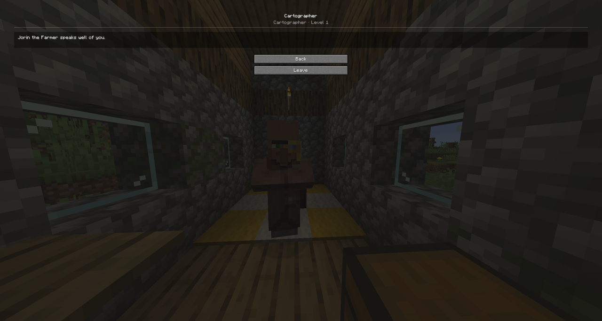
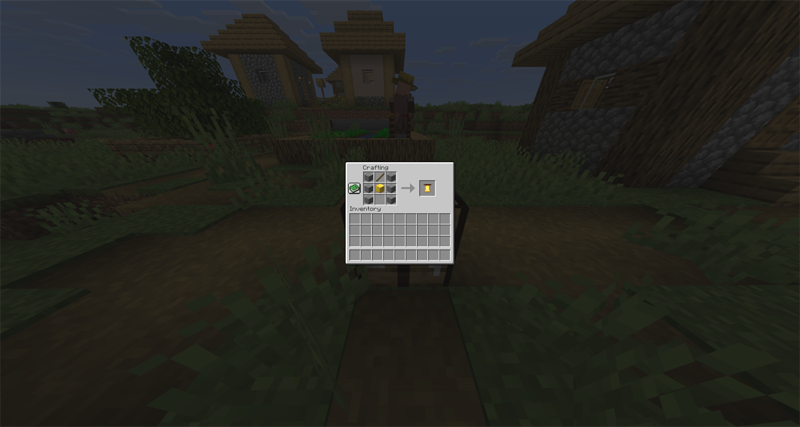
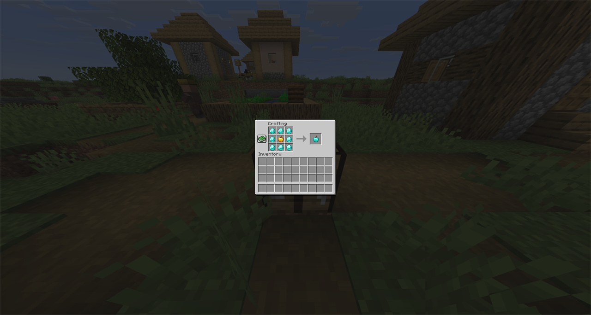

# Villager Enhanced

A NeoForge mod that turns Minecraft's villagers from vending machines into people. Right-clicking
a villager opens a conversation instead of a trade window — and they have names, opinions about
you, and things to say about each other.



| | |
|---|---|
| **Version** | 1.0.0 |
| **Minecraft** | 26.2 |
| **NeoForge** | 26.2.0.62 or newer |
| **Java** | 25 |
| **Licence** | [MIT](LICENSE) |

> NeoForge 26.2 is now a **stable** line. `26.2.0.62` is both the version this is built against
> and the minimum it will run on, since the mod metadata declares `[26.2.0.62,)`.

## What 1.0 promises

**Your worlds keep working.** Villager names, and what each villager remembers about each player,
keep their stored shape. Fields may be added later — they carry defaults — but nothing already
saved stops being read.

**Settings keep their names.** Renaming a config key silently resets it for anyone who had tuned
it, so keys stay put.

**The escape hatch stays.** `dialogueEnabled = false` will always restore ordinary vanilla
trading, leaving the mod installed but dormant.

Breaking any of those means 2.0.0.

**Deliberately not covered:** the client/server protocol. It is internal and already carries its
own version, which turns a mismatch into a clean refusal to connect rather than a subtle
misreading — so it will keep changing, and clients and servers will keep needing to match.

1.0 was never going to mean "packmakers can extend it". Data-driven dialogue is parked, and a
version number promising stability should promise it about things that exist rather than about a
format invented to justify the number.

## What it does

**Villagers have names.** Assigned per villager and remembered, distinct within a village, and
drawn from different pools by biome so a desert settlement sounds unlike a taiga one. They keep
their name through zombification and curing. A name tag still wins.

**They decide how much to tell you.** A villager you have never spoken to is "the Farmer" until
you ask their name — and someone who resents you will not tell you. What else they will do rises
with how they feel about you:

| Standing | They will |
|---|---|
| Reviled / Disliked | trade, accept gifts, tell you exactly what they think of you |
| Stranger | …give you their name |
| Acquaintance | …gossip about the neighbours, and talk about starting a family |
| Trusted | …show you what they are carrying |

**They have opinions, and you can change them.** Reputation shows as a named tier rather than a
number, and you can shift it by trading or by giving gifts — anything they would buy, or any
food. Gifts cannot buy the highest regard; that still takes curing a zombie villager. Anything a
villager can actually use goes into their inventory rather than vanishing, so a gift of bread
feeds them for real.

**They tell you why the village stopped growing.** Ask whether they see themselves starting a
family and they say what is stopping them. Minecraft has always needed two things for a villager
to breed — enough food, and a spare bed for the child — and has never mentioned either. *"There's
nowhere to put a child"* is a diagnosis you cannot get any other way.

**They talk about each other.** Ask what the others say about you and a villager relays their
neighbours' opinions, by name. Minecraft has always run this gossip network — villagers form
opinions and pass them around when they meet — and it has never been visible. A villager you have
never met can already have an opinion of you, because they heard it from someone who has.

**They remember you.** Greetings differ for a stranger, a returning acquaintance, and someone who
has been away a few days. Look at a villager who has told you their name and it appears above
their head — only theirs, and only for the players they have introduced themselves to, so it
reads as a record of who you know rather than a shortcut past asking.

**They tell you when something happens.** Nearby players hear when a villager is born or killed,
and by what, and when an iron golem is destroyed by something.

**You get thirty seconds' warning before a raid.** Carrying Bad Omen into a village starts a
countdown before the raid actually breaks, which the game never mentions. Villagers react to it
too — walk in carrying an omen and they are afraid of you. **Ringing a bell during a raid lights
up every raider in it**, at any distance and through walls, and tells you how many are left; the
last raider stuck out of sight is what drags a raid on.

**You can build them a bell.** Minecraft has no bell recipe, so a village you built yourself
cannot have one — and the bell is the meeting point villagers gather at to pass opinions around.
Since that gossip is what every reputation and rumour here is read from, this mod adds the recipe
it needs: six stone, a stick and a gold block.

**You can make them better at their trade.** A **diamond apple** — eight diamonds around a golden
one — raises a villager one trade level when you offer it in conversation, or frees a nitwit to
take up a trade at all. They will only accept one from someone they already trust, and will hand
it straight back otherwise rather than quietly eating it. It is also edible, at twice a golden
apple.

**Sneak + right-click** skips the conversation and trades directly.

|  |  |
|---|---|
|  |  |
| Where you stand with one villager | What the rest of the village says about you |
|  |  |
| The bell recipe — note the empty slot below the gold | The diamond apple: eight diamonds around a golden apple |

## Configuration

**Mods → Villager Enhanced → Config**, or edit the files.

Client settings are personal — voice volume, dialogue speed, whether names show above villagers'
heads, whether to see notifications. Server settings are shared by everyone on the world: whether
the dialogue is enabled at all, sneak-to-trade, whether a villager is occupied for a whole
conversation, conversation range, gift value, rumour count and radius, which events are
announced, the notification radius, and the raid settings.

The split is deliberate: anything affecting what a player can *do* is a server setting, because a
client-side value would simply be a switch to change the rules.

Setting `dialogueEnabled` to false restores vanilla trading entirely, leaving the mod installed
but dormant.

## Building

```bash
./gradlew build
```

The jar lands in `build/libs/`.

## Development

Run configurations, available from the Gradle tool window or your IDE after a sync:

| Task | Purpose |
|---|---|
| `runClient` | Client, playing as `Dev` |
| `runServer` | Dedicated server |
| `runClientDev01` | Second client, playing as `dev01` |
| `runClientDev02` | Third client, playing as `dev02` |

The numbered clients are for multiplayer testing. Each needs its own username *and* its own game
directory — clients sharing one fight over `options.txt`, the logs and the session lock. Start
`runServer`, then connect both to `localhost`.

### Architecture

The dialogue is **server-authoritative**. The server decides when a conversation starts, which
options it offers, and whether to act on a choice; the client renders what it is told and sends
choices back. Every inbound message is re-validated against the server's own view of the world.

Code is split along the client/server boundary, which NeoForge enforces at class-load time:

| Package | Loaded on | Contains |
|---|---|---|
| `dialogue` | both | Interaction, sessions, names, memory, reputation, notifications |
| `network` | both | Payload definitions and serverbound handlers |
| `config` | both | The two config specs |
| `attachment` | both | Saved per-villager data |
| `client` | client only | Screens, clientbound handlers, name plate rendering |

Nothing in the common packages may reference `client` or any `net.minecraft.client` type — a
dedicated server would crash the moment such a class loaded.

Villagers store two pieces of saved data via NeoForge attachments: their name, and what they
remember about each player who has spoken to them.

The name is synced to clients so it can be drawn above the villager's head — but **only to
players that villager has introduced themselves to**, using the attachment's per-player sync
predicate. A client that was never told the name has nothing to render, so "you have to ask" is
enforced on the server rather than relying on the client to withhold something it already holds.
Relationships are never synced at all.

`src/main/resources/META-INF/accesstransformer.cfg` widens two vanilla members: the method that
applies reputation discounts before trading, and the gossip container so gifts can affect it.

## Licence

[MIT](LICENSE).

`TEMPLATE_LICENSE.txt` covers the NeoForge MDK files this project was generated from — the Gradle
build, the wrapper and the CI workflow — and is retained for that reason.
